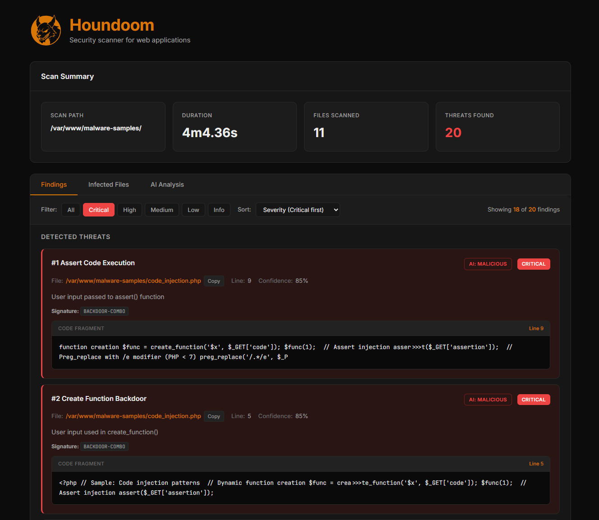

# Houndoom - Security Scanner

[](https://github.com/IvanShishkin/houndoom/actions/workflows/release.yml)
[](https://golang.org/dl/)
[](https://opensource.org/licenses/MIT)


Houndoom is a high-performance security scanner written in Go for detecting malicious code, vulnerabilities, web shells, and threats in web applications. It combines signature-based detection with advanced heuristic analysis and optional AI-powered threat assessment.

## Key Features

- **High Performance:** Multi-threaded scanning with goroutine worker pools
- **Extensible Architecture:** Plugin-based detector system
- **Multiple Scan Modes:** Fast, Normal, and Paranoid
- **AI-Powered Analysis:** Claude API integration for deep threat assessment
- **Advanced Deobfuscation:** 8 deobfuscators with recursive processing (up to 100 levels)
- **Heuristic Analysis:** Entropy analysis, data flow tracking, pattern detection
- **CMS-Specific Detection:** Specialized checks for Bitrix, WordPress, and other CMS
- **Multiple Report Formats:** HTML, JSON, Markdown, Text, XML
- **Agentless Remote Scan:** Recon-only scan of a remote host over SSH — nothing installed on the target — orchestrated and analyzed by Claude Code

## HTML Report

Houndoom generates interactive HTML reports with sortable tables, filtering, code highlighting, and statistics dashboard. [View Live Example](https://shishkin.tech/houndoom_example.html)




## Quick Start

### Installation

**Quick Install (Linux/macOS):**

```bash
# Using curl
curl -sSL https://raw.githubusercontent.com/IvanShishkin/houndoom/main/install.sh | bash

# Using wget
wget -qO- https://raw.githubusercontent.com/IvanShishkin/houndoom/main/install.sh | bash
```

**Installation Options:**

```bash
# Install specific version
curl -sSL .../install.sh | bash -s -- --version=v1.0.0

# Install without sudo (to ~/.local/bin)
curl -sSL .../install.sh | bash -s -- --no-sudo

# Install to custom directory
curl -sSL .../install.sh | bash -s -- --dir=/opt/bin
```

**Manual Installation:**

Download the binary for your platform from [GitHub Releases](https://github.com/IvanShishkin/houndoom/releases).

**Build from Source:**

```bash
# Clone the repository
git clone https://github.com/IvanShishkin/houndoom.git
cd houndoom

# Build the scanner
go build -o bin/houndoom ./cmd/scanner

# Or build for Linux production
GOOS=linux GOARCH=amd64 go build -o bin/houndoom ./cmd/scanner
```

### Basic Usage

```bash
# Scan a directory
houndoom scan /path/to/website

# Scan with AI analysis
houndoom scan /path/to/website --ai

# Paranoid mode with smart AI analysis
houndoom scan /path/to/website --mode=paranoid --ai --ai-smart

# Generate JSON report
houndoom scan /path/to/website --report=json --output=report.json

# Deobfuscate a file
houndoom deob suspicious_file.php

# List available detectors
houndoom detectors list
```


## AI-Powered Analysis

Houndoom integrates with Claude API for intelligent threat assessment:

```bash
# Enable AI analysis
houndoom scan /path --ai --ai-token=YOUR_API_KEY

# Smart mode: deduplication + sampling (cost-effective)
houndoom scan /path --ai-smart

# Choose model: haiku (fast), sonnet (balanced), opus (best)
houndoom scan /path --ai --ai-model=sonnet
```

**AI Features:**
- Deep threat classification with confidence levels
- Remediation suggestions
- False positive detection
- Support for English, Russian, Spanish, German, Chinese

## Agentless Remote Scan (Claude Code)

Scan a remote host **without installing anything on it**. Houndoom runs on your
machine (the control plane), delivers the scanner to the target over SSH, runs a
**recon-only** (read-only) scan, collects the JSON report back, then a Claude Code
skill analyzes the findings. The target only needs to accept SSH — no outbound
internet access required on the target.

This mode is best for locked-down networks, no-agent constraints, and iterative
analyst-driven investigation. It complements (does not replace) the local scanner.

```bash
# Dry-run: print the exact plan without connecting
houndoom remote-scan --host scan@10.0.0.5 --path /var/www --mode paranoid --plan

# Run the recon-only remote scan (asks for confirmation, then connects)
houndoom remote-scan --host scan@10.0.0.5 --path /var/www --mode paranoid

# Stored reports/audit logs live under ~/.houndoom/engagements/<target>-<ts>/
houndoom engagements purge --older-than 720h   # retention cleanup (default 30 days)
```

From **Claude Code**, run the `/houndoom-scan` skill: it collects the target,
runs `remote-scan`, and analyzes the report interactively.

**Security posture (v1):**
- **Recon-only** — read-only on the target; the only remote footprint is a temp
  upload dir that is removed on every path (including failures).
- **SSH keys via ssh-agent only** — there is no `--key` flag; the system `ssh`/`scp`
  clients are used, so `~/.ssh/config` (ProxyJump/bastions, ports, per-host keys)
  works out of the box. Key material is never read or logged.
- **Host-key verification is enforced** (never weakened).
- **Resource limits** — the remote scan runs under `nice` + `timeout` to protect
  client production (`--timeout`, default 1h; optional `--max-size`).
- **Confirmation gate** prints the exact target before connecting (default: abort).
- **Audit log** records every remote command (timestamp, operator, target, action).
- **Agent boundary** — `.claude/settings.json` denies the agent raw
  `ssh`/`scp`/`curl`/… so all target access goes through the audited `remote-scan`
  command, and scanned content is treated as inert data (prompt-injection defense).

## CLI Reference

### Scan Command

```bash
houndoom scan [path] [flags]

# Mode & Performance
  --mode string          fast|normal|paranoid (default "normal")
  --workers int          Worker threads (default: CPU cores × 2)
  --max-size string      Max file size (default "650K")

# Filtering
  --extensions strings   Extensions to scan
  --exclude strings      Directories to exclude
  --detectors strings    Enable specific detectors
  --disable strings      Disable specific detectors
  --experimental         Enable experimental detectors
  --cms string           Force CMS: bitrix|wordpress|laravel|symfony|drupal|joomla

# Reports
  -r, --report string    html|json|txt|xml|md
  -o, --output string    Output file path
  --no-html              Disable HTML report

# AI Analysis
  --ai                   Enable AI analysis
  --ai-smart             Smart mode (dedupe + sampling)
  --ai-model string      haiku|sonnet|opus (default "sonnet")
  --ai-token string      Anthropic API token
  --ai-lang string       en|ru|es|de|zh (default "en")
```

### Remote Scan Command

```bash
houndoom remote-scan [flags]

  --host string       Target in user@host form (required)
  --path string       Absolute path on the target to scan
  --mode string       fast|normal|paranoid (default "normal")
  -o, --output string Report path override (default: per-engagement directory)
  --plan              Print the execution plan without connecting
  --yes               Skip the interactive confirmation gate
  --timeout duration  Wall-clock limit for the remote scan (default 1h)
  --max-size string   Max file size passed to the remote scanner (e.g. 500M)
```

> SSH keys are taken from ssh-agent (there is no `--key` flag). Authorization is
> by key possession — there is no in-app allowlist.

### Other Commands

```bash
# Deobfuscate file
houndoom deob <file>

# List detectors
houndoom detectors list

# Purge stored remote-scan engagement outputs (reports + audit logs)
houndoom engagements purge --older-than 720h
```

## Detected Threats

### PHP
- Web shells (r57, c99, b374k, WSO, FilesMan)
- Backdoors with eval/base64/gzinflate
- Code injection (eval, assert, create_function)
- Command execution (system, exec, shell_exec, passthru, popen)
- File operations with user input
- preg_replace with /e modifier
- Dangerous CMS methods

### JavaScript
- XSS injections (event handlers, DOM-based)
- IFRAME injections
- Obfuscated code (fromCharCode, eval)
- Malicious redirects
- Cookie stealing

### Other
- Phishing pages
- Adware and SEO spam
- Doorway pages
- Unix executables in web directories

### WordPress (auto-detected or `--cms=wordpress`)
- **Backdoors & shells:** fake core files (`wp-xmlrpc.php`, `wp-vcd.php`), eval/gzinflate/str_rot13/base64 chains, filesman/WSO/b374k/P.A.S. shells, cookie-driven eval, fake plugins with shell code, remote file inclusion, hidden admin creation
- **DB-stored payloads & deserialization:** `eval(get_option(...))` loaders, `maybe_unserialize`/`unserialize` on user input, `phar://` triggers
- **Vulnerability patterns:** SQLi via `$wpdb->query/get_results/get_var` (and LIKE interpolation), SSRF via `wp_remote_*`/`wp_safe_remote_*`/`download_url`/curl, unsafe `update_option`, dynamic calls, REST routes with `__return_true`, wp-cron RCE with user input, nonce-less AJAX handlers
- **Auth & privilege escalation:** `wp_set_auth_cookie`, admin insertion, `set_role`/`add_role`/`add_cap`, `grant_super_admin`, `wp_set_current_user`, `wp_capabilities` meta injection
- **Malicious hooks:** `init`/`wp_head`/`wp_footer`/`admin_init`/`the_content` with eval/base64/scripts
- **Active malware families:** WP-VCD, **Balada Injector**, **SocGholish**, modern WASM/WebSocket/pool cryptominers, WooCommerce card skimmers (checkout hijack, Stripe-frame theft, billing-field harvest, Telegram/Discord webhook exfil), pharma/Japanese SEO spam, suspicious-TLD redirects, `siteurl` hijack, UA cloaking
- **Structure anomalies:** PHP in `uploads/`, **mu-plugins persistence** (auto-loaded shells, core-name mimics), fake core files in `wp-includes/`, hidden dot-PHP in themes/plugins, `.htaccess` injection (`auto_prepend_file`, `SetHandler php`, mod_security disable, PHPRC), `.user.ini` auto_prepend (PHP-FPM)

False-positive suppression is applied automatically on WordPress core files and on known security / caching / membership / form / backup plugins (Wordfence, Sucuri, WooCommerce, Jetpack, WP Rocket, Gravity Forms, ...).

## Architecture

```
houndoom/
├── cmd/scanner/           # CLI entry point (Cobra)
├── internal/
│   ├── config/            # Viper-based configuration
│   ├── core/scanner.go    # Main orchestrator, worker pool
│   ├── filesystem/        # File walker (Windows/Unix)
│   ├── detectors/         # Threat detectors
│   │   ├── php/           # PHP backdoors, injection
│   │   ├── javascript/    # XSS, malicious JS
│   │   └── cms/           # CMS-specific detection (bitrix, wordpress)
│   ├── deobfuscator/      # 8 deobfuscators
│   ├── heuristic/         # Heuristic analysis
│   ├── signatures/        # Pattern matching
│   ├── ai/                # Claude API integration
│   ├── remote/            # Agentless remote-scan over SSH (transport, audit, orchestration)
│   ├── engagement/        # Per-engagement output dirs + retention
│   └── report/            # Report generators
├── pkg/models/            # Data models, scoring
├── configs/signatures/    # YAML signature databases
└── .claude/skills/        # Claude Code skills (houndoom-scan)
```

## Development

```bash
# Run tests
go test ./...
go test -v -race ./...

# Linting
make lint
make fmt
make vet

# Build all platforms
make build-all
```

### Adding a Detector

```go
type Detector interface {
    Name() string
    Priority() int
    SupportedExtensions() []string
    Detect(ctx context.Context, file *models.File) ([]*models.Finding, error)
    IsEnabled() bool
    SetEnabled(enabled bool)
}
```

1. Implement interface in `internal/detectors/`
2. Register in `core/scanner.go:initDetectors()`
3. Add signatures to `configs/signatures/`

## Requirements

- Go 1.21+
- Linux, Windows, macOS

## License

MIT License - see [LICENSE](LICENSE)

## Disclaimer

This scanner is provided for security research and website protection purposes only.
Always perform manual verification of detected threats.
